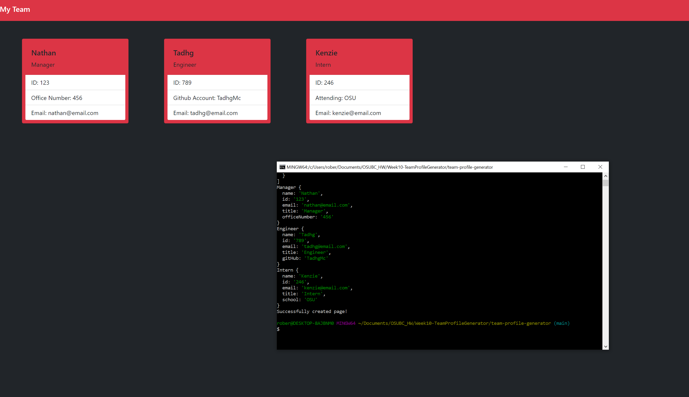

# Team Profile Generator

## Description
Command-Line app that makes a webpage to help keep track of employee info.

## Table of Contents
- [Description](#Description)
- [Installation](#Installation)
- [Usage](#Usage)

## Installation

---

## Usage
After you have installed the above dependencies, you begin the app by running `node index.js` . The app will begin with asking for the title of the Employee you are about to enter information for. Then you fill out the prompted information for that Employee. The app will automatically restart for the next Employee by starting with the title selection again. You can select the "Finished" option in the title selection to finish adding employees, at which point the app will log to the console all of the employee information and create the team html page!

[Link to video demonstration](https://youtu.be/2NU8j9dBoac)

---

## TadhgMc
